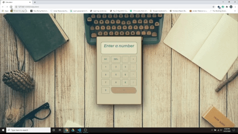

# Welcome to Calculator-JS.
## Purpose: 
This proyect was built as a  practice for javascript basics.
## Description:
A calculator where you can do simple operations (-,/,+,*), including the use of decimals. Contains a Backspace button for when needed. The user will be able to see a string of all the numbers and operations to be calculated by the (=) button.

## [Click to View Live Proyect](https://ajprogramdev.github.io/Calculator-JS/)

